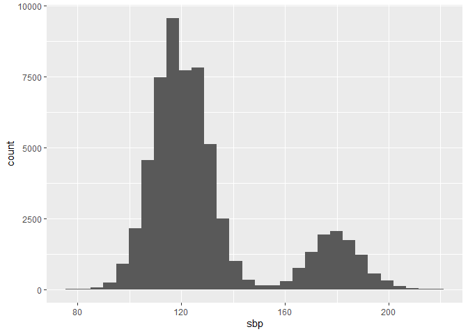

Session 2
================
Dominic Bordelon, Research Data Librarian, University of Pittsburgh
Library System
June 21, 2022

``` r
library(tidyverse)
library(medicaldata)
library(readxl)
library(writexl)
```

# Session 2: Data wrangling

<figure>

<figcaption aria-hidden="true">Artwork by @allison_horst</figcaption>
</figure>

## Agenda

1.  Pipes in R
2.  Selecting columns; filtering and sorting rows
3.  Creating new columns
4.  Grouping and summarizing
5.  Random sampling of rows
6.  Data cleaning: tidy data, missing values
7.  Exporting data from R

Most of what we are doing today is in the {dplyr} and {tidyr} packages.
These PDF cheat sheets are a handy reference:
[dplyr](https://raw.githubusercontent.com/rstudio/cheatsheets/main/data-transformation.pdf),
[tidyr](https://raw.githubusercontent.com/rstudio/cheatsheets/main/tidyr.pdf)

## Pipes in R

The **pipe** is an operator, written **`%>%`**, that enables us to pass
the output from one function, into another function. Consider:

``` r
my_values <- -1:-10    # -1 to -10, as a vector
my_values
```

     [1]  -1  -2  -3  -4  -5  -6  -7  -8  -9 -10

``` r
# below i take the absolute value, then the square root, 
# then round to 3 decimal places, then calculate the mean
mean(round(sqrt(abs(my_values)), 3))
```

    [1] 2.2467

``` r
# with a pipe, this can be rewritten as:
my_values %>% 
  abs() %>% 
  sqrt() %>% 
  round(3) %>%
  mean()
```

    [1] 2.2467

``` r
# more readable, right?
```

The keyboard shortcut for `%>%` is **Ctrl+Shift+M** (Windows) or
**Cmd+Shift+M** (macOS).

You might also see a newer notation for the pipe, `|>`. It works the
same way:

``` r
my_values |>
  abs() |>
  sqrt() |>
  round(3) |>
  mean()
```

    [1] 2.2467

We’ll be using the first pipe, also called “the magrittr pipe” after the
package it comes from.

<figure>

<figcaption aria-hidden="true">magrittr logo</figcaption>
</figure>

## Looking at data frames

`print()`, str()`,`View()`,`summary()\`

``` r
cvdrisk <- read_csv("data/genoData.csv")
```

    Rows: 59874 Columns: 17
    ── Column specification ────────────────────────────────────────────────────────
    Delimiter: ","
    chr (13): patientID, age, htn, treat, smoking, race, t2d, gender, rs10757278...
    dbl  (4): numAge, bmi, tchol, sbp

    ℹ Use `spec()` to retrieve the full column specification for this data.
    ℹ Specify the column types or set `show_col_types = FALSE` to quiet this message.

``` r
cvdrisk %>% print()
```

    # A tibble: 59,874 × 17
       patie…¹ age   htn   treat smoking race  t2d   gender numAge   bmi tchol   sbp
       <chr>   <chr> <chr> <chr> <chr>   <chr> <chr> <chr>   <dbl> <dbl> <dbl> <dbl>
     1 HHUID0… 20-40 N     N     N       White N     F          37    22   175   113
     2 HHUID0… 20-40 N     N     N       White N     F          32    25   156   116
     3 HHUID0… 40-55 Y     N     N       White N     F          40    23   243   193
     4 HHUID0… 20-40 Y     Y     N       White N     F          32    23   157   183
     5 HHUID0… 20-40 N     N     N       White N     M          29    17   156   131
     6 HHUID0… 40-55 Y     N     N       White N     F          40    25   193   164
     7 HHUID0… 40-55 N     N     N       Asia… Y     M          43    25   196   120
     8 HHUID0… 20-40 Y     Y     N       White N     F          20    17   238   188
     9 HHUID0… 20-40 N     N     N       Asia… N     F          37    21   195   113
    10 HHUID0… 20-40 N     N     N       White N     M          24    23   240   125
    # … with 59,864 more rows, 5 more variables: rs10757278 <chr>, rs1333049 <chr>,
    #   rs4665058 <chr>, rs8055236 <chr>, cvd <chr>, and abbreviated variable name
    #   ¹​patientID
    # ℹ Use `print(n = ...)` to see more rows, and `colnames()` to see all variable names

Get a histogram of a variable

``` r
ggplot(cvdrisk, aes(sbp)) + geom_histogram()
```

    `stat_bin()` using `bins = 30`. Pick better value with `binwidth`.



## Selecting columns; filtering and sorting rows

### `select()`: which columns?

``` r
cvdrisk
```

    # A tibble: 59,874 × 17
       patie…¹ age   htn   treat smoking race  t2d   gender numAge   bmi tchol   sbp
       <chr>   <chr> <chr> <chr> <chr>   <chr> <chr> <chr>   <dbl> <dbl> <dbl> <dbl>
     1 HHUID0… 20-40 N     N     N       White N     F          37    22   175   113
     2 HHUID0… 20-40 N     N     N       White N     F          32    25   156   116
     3 HHUID0… 40-55 Y     N     N       White N     F          40    23   243   193
     4 HHUID0… 20-40 Y     Y     N       White N     F          32    23   157   183
     5 HHUID0… 20-40 N     N     N       White N     M          29    17   156   131
     6 HHUID0… 40-55 Y     N     N       White N     F          40    25   193   164
     7 HHUID0… 40-55 N     N     N       Asia… Y     M          43    25   196   120
     8 HHUID0… 20-40 Y     Y     N       White N     F          20    17   238   188
     9 HHUID0… 20-40 N     N     N       Asia… N     F          37    21   195   113
    10 HHUID0… 20-40 N     N     N       White N     M          24    23   240   125
    # … with 59,864 more rows, 5 more variables: rs10757278 <chr>, rs1333049 <chr>,
    #   rs4665058 <chr>, rs8055236 <chr>, cvd <chr>, and abbreviated variable name
    #   ¹​patientID
    # ℹ Use `print(n = ...)` to see more rows, and `colnames()` to see all variable names

``` r
str(cvdrisk)    # 17 variables (columns)
```

    spec_tbl_df [59,874 × 17] (S3: spec_tbl_df/tbl_df/tbl/data.frame)
     $ patientID : chr [1:59874] "HHUID00520605" "HHUID00576813" "HHUID00957042" "HHUID00226899" ...
     $ age       : chr [1:59874] "20-40" "20-40" "40-55" "20-40" ...
     $ htn       : chr [1:59874] "N" "N" "Y" "Y" ...
     $ treat     : chr [1:59874] "N" "N" "N" "Y" ...
     $ smoking   : chr [1:59874] "N" "N" "N" "N" ...
     $ race      : chr [1:59874] "White" "White" "White" "White" ...
     $ t2d       : chr [1:59874] "N" "N" "N" "N" ...
     $ gender    : chr [1:59874] "F" "F" "F" "F" ...
     $ numAge    : num [1:59874] 37 32 40 32 29 40 43 20 37 24 ...
     $ bmi       : num [1:59874] 22 25 23 23 17 25 25 17 21 23 ...
     $ tchol     : num [1:59874] 175 156 243 157 156 193 196 238 195 240 ...
     $ sbp       : num [1:59874] 113 116 193 183 131 164 120 188 113 125 ...
     $ rs10757278: chr [1:59874] "AA" "AA" "AA" "AA" ...
     $ rs1333049 : chr [1:59874] "CC" "CC" "CC" "CC" ...
     $ rs4665058 : chr [1:59874] "CC" "CC" "AA" "CC" ...
     $ rs8055236 : chr [1:59874] "TT" "TT" "TT" "GG" ...
     $ cvd       : chr [1:59874] "N" "N" "N" "N" ...
     - attr(*, "spec")=
      .. cols(
      ..   patientID = col_character(),
      ..   age = col_character(),
      ..   htn = col_character(),
      ..   treat = col_character(),
      ..   smoking = col_character(),
      ..   race = col_character(),
      ..   t2d = col_character(),
      ..   gender = col_character(),
      ..   numAge = col_double(),
      ..   bmi = col_double(),
      ..   tchol = col_double(),
      ..   sbp = col_double(),
      ..   rs10757278 = col_character(),
      ..   rs1333049 = col_character(),
      ..   rs4665058 = col_character(),
      ..   rs8055236 = col_character(),
      ..   cvd = col_character()
      .. )
     - attr(*, "problems")=<externalptr> 

``` r
cvdrisk %>% 
  select(numAge, gender, bmi, treat)
```

    # A tibble: 59,874 × 4
       numAge gender   bmi treat
        <dbl> <chr>  <dbl> <chr>
     1     37 F         22 N    
     2     32 F         25 N    
     3     40 F         23 N    
     4     32 F         23 Y    
     5     29 M         17 N    
     6     40 F         25 N    
     7     43 M         25 N    
     8     20 F         17 Y    
     9     37 F         21 N    
    10     24 M         23 N    
    # … with 59,864 more rows
    # ℹ Use `print(n = ...)` to see more rows

``` r
# how many columns do we have? how many rows?
# notice that the column order is also different

# you can also select using index numbers:
cvdrisk %>%
  select(3:7)
```

    # A tibble: 59,874 × 5
       htn   treat smoking race     t2d  
       <chr> <chr> <chr>   <chr>    <chr>
     1 N     N     N       White    N    
     2 N     N     N       White    N    
     3 Y     N     N       White    N    
     4 Y     Y     N       White    N    
     5 N     N     N       White    N    
     6 Y     N     N       White    N    
     7 N     N     N       Asian/PI Y    
     8 Y     Y     N       White    N    
     9 N     N     N       Asian/PI N    
    10 N     N     N       White    N    
    # … with 59,864 more rows
    # ℹ Use `print(n = ...)` to see more rows

### `filter()`: which rows?

<figure>

<figcaption aria-hidden="true">Artwork by @allison_horst</figcaption>
</figure>

``` r
cvdrisk %>%
  filter(numAge == 19) %>% 
  select(patientID, numAge, smoking)
```

    # A tibble: 716 × 3
       patientID     numAge smoking
       <chr>          <dbl> <chr>  
     1 HHUID00164346     19 N      
     2 HHUID00802705     19 N      
     3 HHUID00782633     19 N      
     4 HHUID00732619     19 N      
     5 HHUID00732812     19 Y      
     6 HHUID00293504     19 N      
     7 HHUID00506980     19 N      
     8 HHUID00944871     19 N      
     9 HHUID00158191     19 N      
    10 HHUID00786858     19 N      
    # … with 706 more rows
    # ℹ Use `print(n = ...)` to see more rows

``` r
cvdrisk %>%
  filter(tchol > 200)
```

    # A tibble: 15,797 × 17
       patie…¹ age   htn   treat smoking race  t2d   gender numAge   bmi tchol   sbp
       <chr>   <chr> <chr> <chr> <chr>   <chr> <chr> <chr>   <dbl> <dbl> <dbl> <dbl>
     1 HHUID0… 40-55 Y     N     N       White N     F          40    23   243   193
     2 HHUID0… 20-40 Y     Y     N       White N     F          20    17   238   188
     3 HHUID0… 20-40 N     N     N       White N     M          24    23   240   125
     4 HHUID0… 20-40 Y     Y     N       White N     F          23    24   235   201
     5 HHUID0… 40-55 N     N     N       White N     F          41    22   243   118
     6 HHUID0… 20-40 N     N     N       White N     F          33    33   204   122
     7 HHUID0… 40-55 N     N     N       Blac… N     M          42    21   244   139
     8 HHUID0… 20-40 N     N     N       Blac… N     M          29    24   242   112
     9 HHUID0… 20-40 N     N     N       Blac… N     M          31    23   219   120
    10 HHUID0… 20-40 N     N     N       White N     M          30    19   228   128
    # … with 15,787 more rows, 5 more variables: rs10757278 <chr>, rs1333049 <chr>,
    #   rs4665058 <chr>, rs8055236 <chr>, cvd <chr>, and abbreviated variable name
    #   ¹​patientID
    # ℹ Use `print(n = ...)` to see more rows, and `colnames()` to see all variable names

``` r
# comparisons: > >= < <= == !=


# check multiple values with the %in% operator, and a vector:
cvdrisk %>%
  filter(race %in% c("Black/AfAm", "AmInd"))
```

    # A tibble: 3,630 × 17
       patie…¹ age   htn   treat smoking race  t2d   gender numAge   bmi tchol   sbp
       <chr>   <chr> <chr> <chr> <chr>   <chr> <chr> <chr>   <dbl> <dbl> <dbl> <dbl>
     1 HHUID0… 40-55 N     N     N       Blac… N     M          42    21   244   139
     2 HHUID0… 20-40 N     N     N       AmInd N     F          28    19   165   124
     3 HHUID0… 20-40 N     N     N       Blac… N     M          29    24   242   112
     4 HHUID0… 20-40 N     N     N       Blac… N     M          31    23   219   120
     5 HHUID0… 20-40 N     N     N       Blac… N     F          34    23   243   113
     6 HHUID0… 20-40 N     N     N       Blac… Y     F          31    19   231    99
     7 HHUID0… 20-40 N     N     N       Blac… N     F          27    20   218   120
     8 HHUID0… 40-55 Y     N     N       Blac… N     F          42    23   228   173
     9 HHUID0… 20-40 N     N     N       Blac… N     F          35    24   241   123
    10 HHUID0… 20-40 N     N     N       Blac… N     M          30    19   243   109
    # … with 3,620 more rows, 5 more variables: rs10757278 <chr>, rs1333049 <chr>,
    #   rs4665058 <chr>, rs8055236 <chr>, cvd <chr>, and abbreviated variable name
    #   ¹​patientID
    # ℹ Use `print(n = ...)` to see more rows, and `colnames()` to see all variable names

``` r
cvdrisk %>% 
  distinct(race)
```

    # A tibble: 4 × 1
      race      
      <chr>     
    1 White     
    2 Asian/PI  
    3 Black/AfAm
    4 AmInd     

``` r
# BMI is between 25 and 30 (inclusive):
cvdrisk %>%
  filter(between(bmi, 25, 30))
```

    # A tibble: 8,428 × 17
       patie…¹ age   htn   treat smoking race  t2d   gender numAge   bmi tchol   sbp
       <chr>   <chr> <chr> <chr> <chr>   <chr> <chr> <chr>   <dbl> <dbl> <dbl> <dbl>
     1 HHUID0… 20-40 N     N     N       White N     F          32    25   156   116
     2 HHUID0… 40-55 Y     N     N       White N     F          40    25   193   164
     3 HHUID0… 40-55 N     N     N       Asia… Y     M          43    25   196   120
     4 HHUID0… 20-40 N     N     N       Asia… N     F          26    26   160   105
     5 HHUID0… 20-40 N     N     N       White N     F          31    25   194   102
     6 HHUID0… 20-40 N     N     N       White N     F          24    25   159   123
     7 HHUID0… 20-40 N     N     N       White N     F          22    29   156   128
     8 HHUID0… 40-55 Y     N     N       Asia… N     M          43    25   157   177
     9 HHUID0… 40-55 Y     Y     N       White N     M          44    26   233   193
    10 HHUID0… 20-40 N     N     Y       White N     F          30    25   160   108
    # … with 8,418 more rows, 5 more variables: rs10757278 <chr>, rs1333049 <chr>,
    #   rs4665058 <chr>, rs8055236 <chr>, cvd <chr>, and abbreviated variable name
    #   ¹​patientID
    # ℹ Use `print(n = ...)` to see more rows, and `colnames()` to see all variable names

Multiple conditions can be combined with the symbols `&` (ampersand,
“AND”) and `|` (vertical pipe, “OR”).

``` r
cvdrisk %>% 
  filter(between(numAge, 19, 24) & smoking == "Y")
```

    # A tibble: 1,412 × 17
       patie…¹ age   htn   treat smoking race  t2d   gender numAge   bmi tchol   sbp
       <chr>   <chr> <chr> <chr> <chr>   <chr> <chr> <chr>   <dbl> <dbl> <dbl> <dbl>
     1 HHUID0… 20-40 N     N     Y       White N     F          24    35   157   128
     2 HHUID0… 20-40 N     N     Y       White N     M          24    15   198   132
     3 HHUID0… 20-40 Y     Y     Y       White N     M          20    24   243   180
     4 HHUID0… 20-40 N     N     Y       Asia… N     M          24    21   177   107
     5 HHUID0… 20-40 Y     N     Y       White N     M          22    27   159   178
     6 HHUID0… 20-40 Y     Y     Y       White N     F          24    18   160   189
     7 HHUID0… 20-40 N     N     Y       White N     F          21    25   243   122
     8 HHUID0… 20-40 N     N     Y       Asia… Y     M          22    28   156   112
     9 HHUID0… 20-40 N     N     Y       White N     F          21    20   179   122
    10 HHUID0… 20-40 N     N     Y       White N     F          24    19   227   117
    # … with 1,402 more rows, 5 more variables: rs10757278 <chr>, rs1333049 <chr>,
    #   rs4665058 <chr>, rs8055236 <chr>, cvd <chr>, and abbreviated variable name
    #   ¹​patientID
    # ℹ Use `print(n = ...)` to see more rows, and `colnames()` to see all variable names

``` r
cvdrisk %>% 
  filter(between(numAge, 19, 24) | smoking == "Y")
```

    # A tibble: 17,417 × 17
       patie…¹ age   htn   treat smoking race  t2d   gender numAge   bmi tchol   sbp
       <chr>   <chr> <chr> <chr> <chr>   <chr> <chr> <chr>   <dbl> <dbl> <dbl> <dbl>
     1 HHUID0… 20-40 Y     Y     N       White N     F          20    17   238   188
     2 HHUID0… 20-40 N     N     N       White N     M          24    23   240   125
     3 HHUID0… 20-40 Y     Y     N       White N     F          23    24   235   201
     4 HHUID0… 20-40 N     N     Y       White N     F          29    20   164   127
     5 HHUID0… 20-40 N     N     N       White N     F          24    25   159   123
     6 HHUID0… 20-40 N     N     N       White N     F          22    29   156   128
     7 HHUID0… 20-40 Y     N     N       White N     F          24    19   162   188
     8 HHUID0… 20-40 Y     N     Y       Asia… N     F          39    24   172   174
     9 HHUID0… 20-40 N     N     Y       White N     F          40    21   197   112
    10 HHUID0… 20-40 N     N     N       Asia… N     M          23    20   193   115
    # … with 17,407 more rows, 5 more variables: rs10757278 <chr>, rs1333049 <chr>,
    #   rs4665058 <chr>, rs8055236 <chr>, cvd <chr>, and abbreviated variable name
    #   ¹​patientID
    # ℹ Use `print(n = ...)` to see more rows, and `colnames()` to see all variable names

### `arrange()`: in what order should the rows appear?

``` r
# sort by numAge:
cvdrisk %>% 
  filter(between(bmi, 25, 26)) %>% 
  arrange(numAge)
```

    # A tibble: 4,453 × 17
       patie…¹ age   htn   treat smoking race  t2d   gender numAge   bmi tchol   sbp
       <chr>   <chr> <chr> <chr> <chr>   <chr> <chr> <chr>   <dbl> <dbl> <dbl> <dbl>
     1 HHUID0… 0-20  N     N     Y       White N     F          19    25   244   116
     2 HHUID0… 0-20  N     N     N       White N     F          19    25   243   102
     3 HHUID0… 0-20  N     N     N       White N     M          19    25   182   120
     4 HHUID0… 0-20  N     N     N       White N     M          19    25   244   123
     5 HHUID0… 0-20  N     N     N       Asia… N     M          19    25   229   133
     6 HHUID0… 0-20  N     N     N       Asia… N     F          19    25   155   119
     7 HHUID0… 0-20  N     N     N       Asia… N     F          19    25   196   127
     8 HHUID0… 0-20  N     N     N       White N     F          19    25   156   102
     9 HHUID0… 0-20  N     N     N       White N     M          19    25   242   134
    10 HHUID0… 0-20  N     N     N       White N     M          19    25   245   137
    # … with 4,443 more rows, 5 more variables: rs10757278 <chr>, rs1333049 <chr>,
    #   rs4665058 <chr>, rs8055236 <chr>, cvd <chr>, and abbreviated variable name
    #   ¹​patientID
    # ℹ Use `print(n = ...)` to see more rows, and `colnames()` to see all variable names

``` r
# sort by numAge, descending (oldest first):
cvdrisk %>% 
  filter(between(bmi, 25, 26)) %>% 
  arrange(desc(numAge))
```

    # A tibble: 4,453 × 17
       patie…¹ age   htn   treat smoking race  t2d   gender numAge   bmi tchol   sbp
       <chr>   <chr> <chr> <chr> <chr>   <chr> <chr> <chr>   <dbl> <dbl> <dbl> <dbl>
     1 HHUID0… 40-55 Y     Y     N       White N     M          44    26   233   193
     2 HHUID0… 40-55 N     N     N       White N     M          44    25   180   130
     3 HHUID0… 40-55 Y     N     N       White N     F          44    25   158   180
     4 HHUID0… 40-55 Y     Y     N       White N     F          44    25   242   183
     5 HHUID0… 40-55 N     N     N       White N     F          44    25   195   121
     6 HHUID0… 40-55 N     N     N       White N     F          44    25   155   112
     7 HHUID0… 40-55 Y     Y     N       Asia… N     F          44    25   234   181
     8 HHUID0… 40-55 N     N     N       White Y     M          44    25   180   114
     9 HHUID0… 40-55 N     N     N       White N     M          44    25   157   126
    10 HHUID0… 40-55 N     N     N       White Y     M          44    25   242   128
    # … with 4,443 more rows, 5 more variables: rs10757278 <chr>, rs1333049 <chr>,
    #   rs4665058 <chr>, rs8055236 <chr>, cvd <chr>, and abbreviated variable name
    #   ¹​patientID
    # ℹ Use `print(n = ...)` to see more rows, and `colnames()` to see all variable names

``` r
# sort by multiple columns:
cvdrisk %>% 
  arrange(numAge, desc(bmi))
```

    # A tibble: 59,874 × 17
       patie…¹ age   htn   treat smoking race  t2d   gender numAge   bmi tchol   sbp
       <chr>   <chr> <chr> <chr> <chr>   <chr> <chr> <chr>   <dbl> <dbl> <dbl> <dbl>
     1 HHUID0… 0-20  N     N     N       White N     M          19    36   180   111
     2 HHUID0… 0-20  N     N     N       White Y     M          19    36   155   119
     3 HHUID0… 0-20  N     N     N       White N     F          19    36   242   119
     4 HHUID0… 0-20  N     N     N       White N     M          19    36   158   134
     5 HHUID0… 0-20  N     N     N       White N     M          19    36   155   121
     6 HHUID0… 0-20  N     N     N       White Y     M          19    36   157   126
     7 HHUID0… 0-20  N     N     Y       Blac… N     F          19    35   158   117
     8 HHUID0… 0-20  N     N     N       White N     M          19    35   171   123
     9 HHUID0… 0-20  N     N     N       White Y     F          19    35   225    97
    10 HHUID0… 0-20  N     N     N       White Y     M          19    35   186   113
    # … with 59,864 more rows, 5 more variables: rs10757278 <chr>, rs1333049 <chr>,
    #   rs4665058 <chr>, rs8055236 <chr>, cvd <chr>, and abbreviated variable name
    #   ¹​patientID
    # ℹ Use `print(n = ...)` to see more rows, and `colnames()` to see all variable names

## Exercise 1

1.  Using `filter()`, get patients aged 30+ whose systolic blood
    pressure is greater than 135. Store this set as an object called
    `high_bp`.

``` r
high_bp <- cvdrisk %>% filter(numAge >= 30 & sbp > 135)
```

2.  Sort `high_bp` according to numeric age and systolic blood pressure.

``` r
high_bp %>% 
  arrange(numAge, sbp) %>% View()
```

3.  Why doesn’t the code below work? Can you fix it?

``` r
cvdrisk %>% 
  select(age, htn, treat, smoking, race, t2d, gender, bmi) %>% 
  filter(t2d == "Y") %>% 
  arrange(numAge)
```

## `mutate()`: Creating new columns

<figure>

<figcaption aria-hidden="true">Artwork by @allison_horst</figcaption>
</figure>

Example using the `smartpill` dataset:

``` r
str(smartpill)
```

    'data.frame':   95 obs. of  22 variables:
     $ Group                  : num  0 0 0 0 0 0 0 0 1 1 ...
     $ Gender                 : num  1 1 1 1 0 1 1 0 1 0 ...
     $ Race                   : num  NA NA NA NA NA NA NA NA 1 1 ...
     $ Height                 : num  183 180 180 175 152 ...
     $ Weight                 : num  102.1 102.1 68 69.9 44.9 ...
     $ Age                    : num  25 39 44 53 57 43 38 23 21 24 ...
     $ GE.Time                : num  74.3 73.3 4.3 NA 13.9 23.3 7.5 5.6 2.73 5.02 ...
     $ SB.Time                : num  8.4 13.8 6.7 NA 5.1 8.7 3.7 3.4 5.12 3.3 ...
     $ C.Time                 : num  NA NA NA NA NA ...
     $ WG.Time                : num  816 168 240 216 120 ...
     $ S.Contractions         : num  NA NA NA NA NA NA NA NA 145 114 ...
     $ S.Sum.of.Amplitudes    : num  NA NA NA NA NA ...
     $ S.Mean.Peak.Amplitude  : num  NA NA NA NA NA ...
     $ S.Mean.pH              : num  NA NA NA NA NA NA NA NA 2.07 2.28 ...
     $ SB.Contractions        : num  NA NA NA NA NA NA NA NA 298 782 ...
     $ SB.Sum.of.Amplitudes   : num  NA NA NA NA NA ...
     $ SB.Mean.Peak.Amplitude : num  NA NA NA NA NA ...
     $ SB.Mean.pH             : num  NA NA NA NA NA NA NA NA 7.26 7.21 ...
     $ Colon.Contractions     : num  NA NA NA NA NA NA NA NA 507 50 ...
     $ Colon.Sum.of.Amplitudes: num  NA NA NA NA NA ...
     $ C.Mean.Peak.Amplitude  : num  NA NA NA NA NA ...
     $ C.Mean.pH              : num  NA NA NA NA NA NA NA NA 7.58 7.21 ...

``` r
smartpill %>% 
  select(1:6) %>% 
  mutate(BMI = Height / Weight^2)
```

       Group Gender Race  Height    Weight Age        BMI
    1      0      1   NA 182.880 102.05820  25 0.01755781
    2      0      1   NA 180.340 102.05820  39 0.01731395
    3      0      1   NA 180.340  68.03880  44 0.03895640
    4      0      1   NA 175.260  69.85317  53 0.03591787
    5      0      0   NA 152.400  44.90561  57 0.07557598
    6      0      1   NA 185.420  94.80073  43 0.02063162
    7      0      1   NA 187.960  86.18248  38 0.02530623
    8      0      0   NA 165.100  76.20346  23 0.02843137
    9      1      1    1 172.720  74.38909  21 0.03121218
    10     1      0    1 170.180  64.86366  24 0.04044880
    11     1      1    3 180.340  58.96696  24 0.05186502
    12     1      0    1 160.020  72.57472  28 0.03038110
    13     1      1    1 180.340  81.64656  23 0.02705305
    14     1      0    1 161.290  58.96696  32 0.04638632
    15     1      1    3 180.340  69.39958  22 0.03744367
    16     1      1    3 175.260  77.11064  22 0.02947503
    17     1      1    1 175.260  77.11064  56 0.02947503
    18     1      1    2 182.880  87.54326  38 0.02386277
    19     1      0    1 167.640  77.11064  37 0.02819350
    20     1      1    4 172.720  77.11064  40 0.02904785
    21     1      0    2 154.940  79.37860  50 0.02458990
    22     1      1    2 180.340  83.91452  38 0.02561049
    23     1      0    2 175.260  69.85317  18 0.03591787
    24     1      0    1 160.020  61.68851  19 0.04204997
    25     1      1    1 182.880  74.84268  28 0.03264882
    26     1      1    3 175.260  77.56423  31 0.02913130
    27     1      0    4 162.560  59.87414  38 0.04534559
    28     1      1    1 170.180  87.54326  50 0.02220563
    29     1      1    2 175.260  86.18248  44 0.02359635
    30     1      1    4 162.560  60.78133  57 0.04400209
    31     1      1    2 162.560  74.84268  41 0.02902118
    32     1      0    1 167.640  72.57472  50 0.03182782
    33     1      0    1 175.260  79.37860  37 0.02781480
    34     1      1    1 162.560  70.76035  37 0.03246637
    35     1      1    1 177.800  68.03880  23 0.03840771
    36     1      1    1 177.800  97.52228  40 0.01869494
    37     1      0    1 177.800  72.57472  34 0.03375678
    38     1      0    1 172.720  74.84268  64 0.03083500
    39     1      1    1 167.640  96.16150  26 0.01812905
    40     1      1    1 165.100  59.87414  25 0.04605411
    41     1      1    1 175.260  74.84268  48 0.03128846
    42     1      1    1 182.880  95.25432  30 0.02015565
    43     1      0    1 177.800  61.23492  42 0.04741693
    44     1      0    2 162.560 108.86208  34 0.01371704
    45     1      0    1 165.100  54.43104  25 0.05572548
    46     1      1    1 182.880  68.03880  25 0.03950508
    47     1      0    2 172.720  68.03880  30 0.03731035
    48     1      1    1 162.560  85.27530  31 0.02235462
    49     1      0    1 193.040 101.15102  28 0.01886717
    50     1      0    1 157.480  77.11064  44 0.02648481
    51     1      1    1 162.560  68.03880  48 0.03511562
    52     1      0    1 175.260  75.29627  40 0.03091262
    53     1      1    1 175.260  65.77084  43 0.04051502
    54     1      1    1 172.720  71.66754  42 0.03362774
    55     1      1    1 193.040 111.13004  53 0.01563091
    56     1      0    1 165.100 111.13004  34 0.01336854
    57     1      1    2 180.340  72.57472  26 0.03423902
    58     1      1    2 165.100  81.64656  29 0.02476688
    59     1      1    1 182.880  90.71840  40 0.02222161
    60     1      0    1 157.480  95.25432  52 0.01735626
    61     1      0    1 157.480  51.70949  66 0.05889588
    62     1      1    1 177.800  74.84268  20 0.03174191
    63     1      1    1 191.770 127.00576  43 0.01188869
    64     1      1    1 182.880  81.64656  55 0.02743408
    65     1      1    1 179.070 114.30518  72 0.01370538
    66     1      0    1 160.020  66.22443  52 0.03648697
    67     1      1    1 180.340  87.54326  20 0.02353134
    68     1      1    3 175.260  72.57472  29 0.03327454
    69     1      0    1 152.400  53.97745  25 0.05230706
    70     1      0    1 167.640  68.03880  38 0.03621299
    71     1      1    1 175.260  97.52228  33 0.01842787
    72     1      0    1 170.180  74.84268  29 0.03038155
    73     1      0    1 167.640  57.60618  30 0.05051722
    74     1      0    1 165.100  67.13162  44 0.03663472
    75     1      0    1 162.560  65.99764  46 0.03732131
    76     1      0    1 172.720  78.47142  51 0.02804915
    77     1      0    1 169.672  58.46801  30 0.04963335
    78     1      1    1 190.500 106.95699  34 0.01665239
    79     1      0    1 157.480  64.68222  57 0.03764052
    80     1      1    1 179.070  64.63686  26 0.04286100
    81     1      1    1 180.340  68.26560  26 0.03869798
    82     1      0    1 181.864  97.15941  30 0.01926536
    83     1      0    1 165.100  77.11064  61 0.02776633
    84     1      1    1 187.960 108.86208  49 0.01586033
    85     1      1    1 179.070 102.73859  59 0.01696507
    86     1      1    3 145.542  77.06528  35 0.02450591
    87     1      0    1 132.080  56.24541  55 0.04175062
    88     1      1    2 179.070  82.00943  29 0.02662534
    89     1      1    4 180.340  77.20136  33 0.03025814
    90     1      1    2 175.260  83.46093  44 0.02516033
    91     1      0    5 163.830  57.96906  38 0.04875296
    92     1      1    1 187.960  90.71840  28 0.02283887
    93     1      0    1 171.450  61.59779  21 0.04518634
    94     1      0    1 154.940  58.69480  43 0.04497428
    95     1      0    1 162.560  59.78343  27 0.04548331

## Grouping and summarizing

Often, our observations can be arranged into interesting *groups*,
typically based on a categorical variable (e.g., gender, race, age
group, treatment). Our next step is usually to *summarize* those groups:
how many observations in each group? What are the median and mean
values, standard deviation, etc.?

Available summarizing functions:

-   `n()`, `n_distinct()`
-   `mean()`, `median()`, `sum()`
-   `quantile()`, `min()`, `max()`, `IQR()`, `sd()`, `var()`

``` r
cvdrisk %>%
  group_by(smoking) %>%
  summarize(n(), mean(numAge), mean(bmi), mean(sbp), mean(tchol))
```

    # A tibble: 2 × 6
      smoking `n()` `mean(numAge)` `mean(bmi)` `mean(sbp)` `mean(tchol)`
      <chr>   <int>          <dbl>       <dbl>       <dbl>         <dbl>
    1 N       52992           32.1        22.1        129.          187.
    2 Y        6882           32.1        21.9        136.          189.

``` r
# pause here for students to try
```

``` r
# or to apply the same summary function across() columns:
cvdrisk %>%
  group_by(smoking) %>%
  summarize(n(), across(c(numAge, bmi, sbp, tchol), mean))
```

    # A tibble: 2 × 6
      smoking `n()` numAge   bmi   sbp tchol
      <chr>   <int>  <dbl> <dbl> <dbl> <dbl>
    1 N       52992   32.1  22.1  129.  187.
    2 Y        6882   32.1  21.9  136.  189.

<figure>

<figcaption aria-hidden="true">Artwork by @allison_horst</figcaption>
</figure>

## `slice_sample()`: Random sampling of rows

meaning of “slice”

``` r
cvdrisk %>% 
  slice_sample(prop=0.2)
```

    # A tibble: 11,974 × 17
       patie…¹ age   htn   treat smoking race  t2d   gender numAge   bmi tchol   sbp
       <chr>   <chr> <chr> <chr> <chr>   <chr> <chr> <chr>   <dbl> <dbl> <dbl> <dbl>
     1 HHUID0… 20-40 N     N     N       White N     M          29    26   196   125
     2 HHUID0… 20-40 Y     N     N       White N     F          23    23   238   172
     3 HHUID0… 20-40 N     N     N       White N     F          27    28   182   126
     4 HHUID0… 20-40 N     N     N       Asia… N     M          36    22   159   126
     5 HHUID0… 20-40 N     N     N       Asia… N     F          30    29   208   117
     6 HHUID0… 20-40 N     N     N       Blac… N     F          39    25   205   127
     7 HHUID0… 20-40 Y     N     N       White N     F          33    22   243   183
     8 HHUID0… 20-40 Y     Y     N       White N     F          38    18   242   188
     9 HHUID0… 20-40 N     N     N       Blac… N     M          28    19   242   116
    10 HHUID0… 40-55 N     N     N       White N     M          41    20   160   110
    # … with 11,964 more rows, 5 more variables: rs10757278 <chr>, rs1333049 <chr>,
    #   rs4665058 <chr>, rs8055236 <chr>, cvd <chr>, and abbreviated variable name
    #   ¹​patientID
    # ℹ Use `print(n = ...)` to see more rows, and `colnames()` to see all variable names

## Data cleaning: tidy data, missing values

When a dataset doesn’t have one observation per row and/or one variable
per column, we need to **reshape** it using `{tidyr}`.

<figure>

<figcaption aria-hidden="true">Artwork by @allison_horst</figcaption>
</figure>

In `table2`, one column shows `type` (of measurement), either “cases” or
“population.”

``` r
View(table2)
```

We can use the information in `type` to make two new columns, `cases`
and `population`, which hold the value of `count`. We do this with
`pivot_wider()`:

``` r
table2 %>% 
  pivot_wider(names_from=type, values_from=count)
```

    # A tibble: 6 × 4
      country      year  cases population
      <chr>       <int>  <int>      <int>
    1 Afghanistan  1999    745   19987071
    2 Afghanistan  2000   2666   20595360
    3 Brazil       1999  37737  172006362
    4 Brazil       2000  80488  174504898
    5 China        1999 212258 1272915272
    6 China        2000 213766 1280428583

In contrast, `table4a` has a column for each year; we would like to move
year information into its own column, and reduce the overall number of
columns to make the table “longer”—`pivot_longer()`.

``` r
table4a
```

    # A tibble: 3 × 3
      country     `1999` `2000`
    * <chr>        <int>  <int>
    1 Afghanistan    745   2666
    2 Brazil       37737  80488
    3 China       212258 213766

``` r
table4a %>% 
  pivot_longer(cols=c(`1999`, `2000`), names_to="year", values_to="cases")
```

    # A tibble: 6 × 3
      country     year   cases
      <chr>       <chr>  <int>
    1 Afghanistan 1999     745
    2 Afghanistan 2000    2666
    3 Brazil      1999   37737
    4 Brazil      2000   80488
    5 China       1999  212258
    6 China       2000  213766

## Exporting data from R

### Saving as CSV (readr)

``` r
write_csv(high_bp, "high-bp.csv")
```

### Saving as XLSX

``` r
write_xlsx(high_bp, "high-bp.xlsx")
```

### Saving as RDS and RData

.RDS and .RData are two file formats specific to R.

-   **RDS**, “R data structure” (I think), is for saving an R *object*
    (e.g., data frame) to disk. This file will be smaller than a CSV or
    XLSX and faster to load/save in R. This makes it a good choice for
    saving a dataset you’re working on.
-   **RData** is for saving your R *session* (Environment pane) to disk.
    Upon starting a session, this can be a faster way to restore your
    workspace than running your entire notebook again.

To save an object as RDS:

``` r
saveRDS(cvdrisk, "data/cvdrisk.RDS")
```

To load an RDS file into an R object:

``` r
loaded_cvdrisk <- readRDS("data/cvdrisk.RDS")

# what does this loaded RDS look like?
str(loaded_cvdrisk)
```

    spec_tbl_df [59,874 × 17] (S3: spec_tbl_df/tbl_df/tbl/data.frame)
     $ patientID : chr [1:59874] "HHUID00520605" "HHUID00576813" "HHUID00957042" "HHUID00226899" ...
     $ age       : chr [1:59874] "20-40" "20-40" "40-55" "20-40" ...
     $ htn       : chr [1:59874] "N" "N" "Y" "Y" ...
     $ treat     : chr [1:59874] "N" "N" "N" "Y" ...
     $ smoking   : chr [1:59874] "N" "N" "N" "N" ...
     $ race      : chr [1:59874] "White" "White" "White" "White" ...
     $ t2d       : chr [1:59874] "N" "N" "N" "N" ...
     $ gender    : chr [1:59874] "F" "F" "F" "F" ...
     $ numAge    : num [1:59874] 37 32 40 32 29 40 43 20 37 24 ...
     $ bmi       : num [1:59874] 22 25 23 23 17 25 25 17 21 23 ...
     $ tchol     : num [1:59874] 175 156 243 157 156 193 196 238 195 240 ...
     $ sbp       : num [1:59874] 113 116 193 183 131 164 120 188 113 125 ...
     $ rs10757278: chr [1:59874] "AA" "AA" "AA" "AA" ...
     $ rs1333049 : chr [1:59874] "CC" "CC" "CC" "CC" ...
     $ rs4665058 : chr [1:59874] "CC" "CC" "AA" "CC" ...
     $ rs8055236 : chr [1:59874] "TT" "TT" "TT" "GG" ...
     $ cvd       : chr [1:59874] "N" "N" "N" "N" ...
     - attr(*, "spec")=
      .. cols(
      ..   patientID = col_character(),
      ..   age = col_character(),
      ..   htn = col_character(),
      ..   treat = col_character(),
      ..   smoking = col_character(),
      ..   race = col_character(),
      ..   t2d = col_character(),
      ..   gender = col_character(),
      ..   numAge = col_double(),
      ..   bmi = col_double(),
      ..   tchol = col_double(),
      ..   sbp = col_double(),
      ..   rs10757278 = col_character(),
      ..   rs1333049 = col_character(),
      ..   rs4665058 = col_character(),
      ..   rs8055236 = col_character(),
      ..   cvd = col_character()
      .. )
     - attr(*, "problems")=<externalptr> 

To work with .RData files, the easiest way is to use the load/save icons
at top left of the Environment pane .

There is also an RStudio save-on-exit feature which preserves your
session (as a .RData), so that next time you open RStudio, you can pick
up where you left off. This is convenient, but requires diligent
notebook accounting.

<figure>

<figcaption aria-hidden="true">Tools &gt; Global Options… &gt;
General</figcaption>
</figure>

## Next steps

-   Problem Set 2
-   Next time: data visualization!
