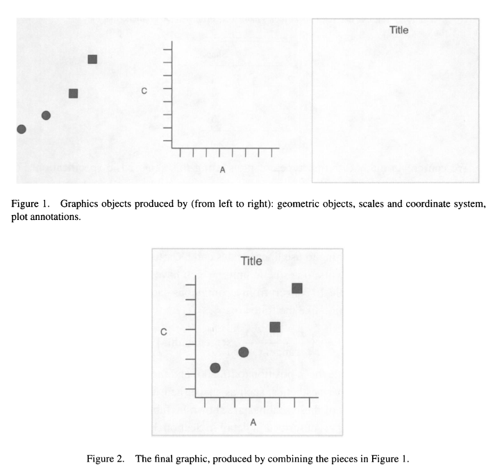

Session 3
================
Dominic Bordelon, Research Data Librarian, University of Pittsburgh
Library System
June 28, 2022

``` r
library(tidyverse)
```

# Session 3: Data visualization and narration

## Agenda

1.  ggplot2 and the grammar of graphics
2.  Geoms (different kinds of plots) and aesthetic mappings
3.  Applying more layers: additional geoms, scales, themes, labels
4.  Using RStudio for writing papers, presentations, etc. (RNotebooks
    and Quarto Documents)

Most of what we are doing today is in the {ggplot2} and {…} packages.
These PDF cheat sheets are a handy reference: ggplot2, …

## ggplot2 and the grammar of graphics

ggplot2 is conceptually based in a “layered grammar of graphics” as
described in Hadley 2010:



Wickham, Hadley. 2010. “A Layered Grammar of Graphics.” Journal of
Computational and Graphical Statistics 19 (1): 3–28.
<https://doi.org/10.1198/jcgs.2009.07098.>

### The “code template” for a plot

Minimal:

`ggplot(data = <DATA>) + <GEOM_FUNCTION>(mapping = aes(<MAPPINGS>))`

`<DATA>` is a dataframe or tibble.

``` r
# cylinder classes plotted together:
mtcars
```

                         mpg cyl  disp  hp drat    wt  qsec vs am gear carb
    Mazda RX4           21.0   6 160.0 110 3.90 2.620 16.46  0  1    4    4
    Mazda RX4 Wag       21.0   6 160.0 110 3.90 2.875 17.02  0  1    4    4
    Datsun 710          22.8   4 108.0  93 3.85 2.320 18.61  1  1    4    1
    Hornet 4 Drive      21.4   6 258.0 110 3.08 3.215 19.44  1  0    3    1
    Hornet Sportabout   18.7   8 360.0 175 3.15 3.440 17.02  0  0    3    2
    Valiant             18.1   6 225.0 105 2.76 3.460 20.22  1  0    3    1
    Duster 360          14.3   8 360.0 245 3.21 3.570 15.84  0  0    3    4
    Merc 240D           24.4   4 146.7  62 3.69 3.190 20.00  1  0    4    2
    Merc 230            22.8   4 140.8  95 3.92 3.150 22.90  1  0    4    2
    Merc 280            19.2   6 167.6 123 3.92 3.440 18.30  1  0    4    4
    Merc 280C           17.8   6 167.6 123 3.92 3.440 18.90  1  0    4    4
    Merc 450SE          16.4   8 275.8 180 3.07 4.070 17.40  0  0    3    3
    Merc 450SL          17.3   8 275.8 180 3.07 3.730 17.60  0  0    3    3
    Merc 450SLC         15.2   8 275.8 180 3.07 3.780 18.00  0  0    3    3
    Cadillac Fleetwood  10.4   8 472.0 205 2.93 5.250 17.98  0  0    3    4
    Lincoln Continental 10.4   8 460.0 215 3.00 5.424 17.82  0  0    3    4
    Chrysler Imperial   14.7   8 440.0 230 3.23 5.345 17.42  0  0    3    4
    Fiat 128            32.4   4  78.7  66 4.08 2.200 19.47  1  1    4    1
    Honda Civic         30.4   4  75.7  52 4.93 1.615 18.52  1  1    4    2
    Toyota Corolla      33.9   4  71.1  65 4.22 1.835 19.90  1  1    4    1
    Toyota Corona       21.5   4 120.1  97 3.70 2.465 20.01  1  0    3    1
    Dodge Challenger    15.5   8 318.0 150 2.76 3.520 16.87  0  0    3    2
    AMC Javelin         15.2   8 304.0 150 3.15 3.435 17.30  0  0    3    2
    Camaro Z28          13.3   8 350.0 245 3.73 3.840 15.41  0  0    3    4
    Pontiac Firebird    19.2   8 400.0 175 3.08 3.845 17.05  0  0    3    2
    Fiat X1-9           27.3   4  79.0  66 4.08 1.935 18.90  1  1    4    1
    Porsche 914-2       26.0   4 120.3  91 4.43 2.140 16.70  0  1    5    2
    Lotus Europa        30.4   4  95.1 113 3.77 1.513 16.90  1  1    5    2
    Ford Pantera L      15.8   8 351.0 264 4.22 3.170 14.50  0  1    5    4
    Ferrari Dino        19.7   6 145.0 175 3.62 2.770 15.50  0  1    5    6
    Maserati Bora       15.0   8 301.0 335 3.54 3.570 14.60  0  1    5    8
    Volvo 142E          21.4   4 121.0 109 4.11 2.780 18.60  1  1    4    2

``` r
ggplot(mtcars) +
  geom_point(aes(x=mpg, y=wt, color=as.factor(cyl)), size=3) 
```


Mappings take the format `aesthetic = variable`, e.g.,
`x = time_elapsed` (the continuous variable `time_elapsed` is on the x
axis) or `color = species` (the categorical variable `species` is
indicated using different colors).

More:

`{ggplot(data = <DATA>) +}   <GEOM_FUNCTION>(mapping = aes(<MAPPINGS>)) +`

`<GEOM_FUNCTION>(mapping = aes(<MAPPINGS>), stat=<STAT>, position=<POSITION>) +   <COORDINATE_FUNCTION> +   <FACET_FUNCTION> +   <SCALE_FUNCTION> +   <THEME_FUNCTION>`

## Exploratory data analysis

``` r
library(tidyverse)
library(medicaldata)
cvdrisk <- read_csv("data/genoData.csv")
```

    Rows: 59874 Columns: 17
    ── Column specification ────────────────────────────────────────────────────────
    Delimiter: ","
    chr (13): patientID, age, htn, treat, smoking, race, t2d, gender, rs10757278...
    dbl  (4): numAge, bmi, tchol, sbp

    ℹ Use `spec()` to retrieve the full column specification for this data.
    ℹ Specify the column types or set `show_col_types = FALSE` to quiet this message.

### Single variable

#### Histograms (continuous)

``` r
# frequency of systolic blood pressure observations:
ggplot(data=cvdrisk) +
  geom_histogram(mapping=aes(x=sbp))
```

    `stat_bin()` using `bins = 30`. Pick better value with `binwidth`.


``` r
# bin widths:
ggplot(data=cvdrisk) +
  geom_histogram(mapping=aes(x=sbp), binwidth=1)
```


``` r
ggplot(data=cvdrisk) +
  geom_histogram(mapping=aes(x=sbp), binwidth=4)
```


``` r
ggplot(data=cvdrisk) +
  geom_histogram(mapping=aes(x=tchol), binwidth=2)   # tchol
```


``` r
ggplot(data=cvdrisk) +
  geom_histogram(mapping=aes(x=numAge), binwidth=1)   # numAge
```


#### Bar charts (discrete)

``` r
# a count of age categories
ggplot(data=cvdrisk) +
  geom_bar(mapping=aes(x=age))
```


``` r
ggplot(data=cvdrisk) +
  geom_bar(mapping=aes(x=race))  # race
```


``` r
# bar charts can also be organized vertically; use a y aes mapping:
ggplot(cvdrisk) + 
  geom_bar(aes(y=age)) +
  scale_x_continuous(position="top")
```


### Piping into ggplot

``` r
# blood pressure distribution among patients aged 25-30
cvdrisk %>% 
  filter(between(numAge, 25, 30)) %>% 
  ggplot() +
  geom_histogram(aes(sbp))
```

    `stat_bin()` using `bins = 30`. Pick better value with `binwidth`.


``` r
# note: after ggplot(), you must switch from %>% to +
```

### Exercise 1

1.  In `cvdrisk`, what do you guess the distribution of smokers
    vs. nonsmokers might be? How can you visualize this with a bar
    chart?

``` r
cvdrisk %>% 
  ggplot() + geom_bar(aes(smoking))
```


2.  Remember the `smartpill` dataset from {medicaldata}? How would you
    plot a histogram of patient age from `smartpill`? (Quick tip: you
    can check a dataframe’s variable names with the `names()` function:
    `names(smartpill)` ) How does this compare to `cvdrisk`’s age
    distribution?

``` r
ggplot(smartpill) +
  geom_histogram(aes(Age), binwidth=2)
```


3.  In `cvdrisk`, do you think the age distribution will be different
    among smokers, as compared to the overall population, and if so,
    how? How can you examine this distribution? (Hint: you will need the
    “piping into ggplot” section above)

``` r
cvdrisk %>% 
  filter(smoking == "Y") %>% 
  ggplot() +
  geom_histogram(aes(numAge), binwidth=1)
```


### Two variables

Two continuous variables: scatter plots (`geom_point()`), smooth lines
(`geom_smooth()`)

``` r
smartpill %>%  ggplot(aes(x=S.Mean.pH, y=Colon.Contractions)) + geom_point() + geom_smooth()
```

    `geom_smooth()` using method = 'loess' and formula 'y ~ x'

    Warning: Removed 16 rows containing non-finite values (stat_smooth).

    Warning: Removed 16 rows containing missing values (geom_point).


``` r
smartpill %>%  ggplot(aes(x=S.Mean.pH, y=S.Mean.Peak.Amplitude)) + geom_point() + geom_smooth()
```

    `geom_smooth()` using method = 'loess' and formula 'y ~ x'

    Warning: Removed 14 rows containing non-finite values (stat_smooth).

    Warning: Removed 14 rows containing missing values (geom_point).


One discrete, one continuous: column charts, box/violin plots

``` r
cvdrisk %>% ggplot() +
  geom_bar(aes(x=t2d, y=bmi), stat="summary", fun="mean")
```


``` r
# bmi for t2d-havers:
cvdrisk %>% ggplot() +
  geom_boxplot(aes(x=t2d, y=bmi))
```


``` r
cvdrisk %>% ggplot() +
  geom_violin(aes(x=t2d, y=bmi))
```


``` r
cvdrisk %>% 
  ggplot() +
  geom_density(aes(x=bmi, color=t2d)) # with color
```


### Using a third aesthetic and variable

Common aesthetic mappings: `x, y, color, fill, size, alpha, ...`

``` r
cvdrisk %>% 
  ggplot() +
  geom_bar(aes(x=t2d, y=bmi, fill=smoking), stat="summary", fun="mean", position="dodge")
```


``` r
# find another/better dodge

as.factor(smartpill$Gender)
```

     [1] 1 1 1 1 0 1 1 0 1 0 1 0 1 0 1 1 1 1 0 1 0 1 0 0 1 1 0 1 1 1 1 0 0 1 1 1 0 0
    [39] 1 1 1 1 0 0 0 1 0 1 0 0 1 0 1 1 1 0 1 1 1 0 0 1 1 1 1 0 1 1 0 0 1 0 0 0 0 0
    [77] 0 1 0 1 1 0 0 1 1 1 0 1 1 1 0 1 0 0 0
    Levels: 0 1

``` r
smartpill %>% 
  ggplot() +
  geom_point(aes(x=Age, y=SB.Mean.pH, color=as.factor(Gender)))
```

    Warning: Removed 16 rows containing missing values (geom_point).


### Exercise 2

1.  Using the `smartpill` dataset, make a scatter plot of Height and
    Weight.

``` r
smartpill %>% 
  ggplot() +
  geom_point(aes(Height, Weight)) + 
  geom_smooth(aes(Height, Weight))
```

    `geom_smooth()` using method = 'loess' and formula 'y ~ x'


2.  Make a violin or box plot of `tchol` distributions for patients who
    have `t2d` versus those who don’t.

``` r
cvdrisk %>% 
  ggplot() +
  geom_violin(aes(x=t2d, y=tchol))
```


## Other geoms

ggplot2 offers several more possibilities for geoms:

-   Line charts: `geom_line()` (can be combined with
    `geom_point()` e.g. for longitudinal “spaghetti plots”)
-   Alternatives to histogram:
    `geom_area(), geom_density(), geom_freqpoly()`
-   Continuous bivariate: `geom_hex(), geom_bin2d(), geom_density2d()`
-   Discrete x discrete: `geom_count()`
-   Continuous function: `geom_line(), geom_area()`
-   Error: `geom_errorbar(), geom_linerange()`
-   `geom_map()` draws geographic maps

## Applying more layers

Additional layers modify the default behavior of geoms. They always get
added to your plot with `+` and are drawn in the order you write them.
Here are examples of what you can do with example:

-   scales (e.g., continuous, discrete, color), e.g., to supply your own
    color scheme, manually set breaks, etc.; they all start with
    `scale_`
-   zoom in/out using `coord_cartesian()` or `xlim() and ylim()`
-   create a pie chart, out of a stacked bar chart, using
    `coord_polar()`
-   set labels with `labs(title="", subtitle="")` and
    `xlab() and ylab()`
-   facet (sub-plot) your data with `facet_wrap() and facet_grid()`
-   theme your plot using `theme()`, or using complete themes, e.g.,
    `theme_minimal()`

## Saving plots

The best way to save plots is using `ggsave()`.

``` r
my_plot <- smartpill %>% 
  ggplot(aes(Height, Weight)) +
  geom_point() +
  geom_smooth()

ggsave("my_plot.png", my_plot)   # as PNG
```

    Saving 7 x 5 in image

    `geom_smooth()` using method = 'loess' and formula 'y ~ x'

``` r
ggsave("my_plot.svg", my_plot)   # as SVG
```

    Saving 7 x 5 in image
    `geom_smooth()` using method = 'loess' and formula 'y ~ x'

## Using RStudio for narration

The Quarto notebooks we’ve been using can be output to different
formats.

### Documents

When you’re ready to save your notebook in a different format, go to the
header of the document (indicated with `---`) and set the `format` field
to `html`, `docx`, or `pdf`, according to what you prefer. Then click
the Render button (top center of editor toolbar). Code will run to
compile your document, and then the file will be saved. Note that you
cannot “run” any part of the rendered notebook.

### Slides

You can also use Quarto notebooks to make slides. Each top-level heading
in the notebook becomes a slide title, and whatever is beneath becomes
the contents of the slide. More info here:
<https://quarto.org/docs/presentations/>

### Using RMarkdown

The process described above is largely the same, except “Render” is
called “Knit.” More info is at <https://rmarkdown.rstudio.com/>.

## Next steps

-   Problem set 3
-   Session 4: Modeling, ???
