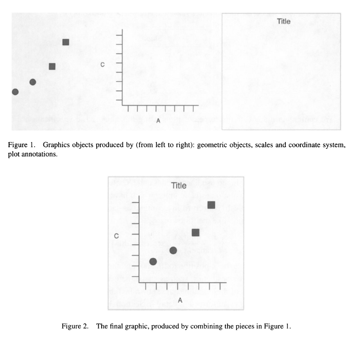

Session 3
================
Dominic Bordelon, Research Data Librarian, University of Pittsburgh
Library System
June 28, 2022

# Session 3: Data visualization and narration

## Agenda

1.  ggplot2 and the grammar of graphics
2.  Geoms (different kinds of plots) and aesthetic mappings
3.  Applying more layers: additional geoms, scales, themes, labels
4.  Using RStudio for writing papers, presentations, etc. (RNotebooks
    and Quarto Documents)

Most of what we are doing today is in the {ggplot2} and {…} packages.
These PDF cheat sheets are a handy reference: ggplot2, …

## ggplot2 and the grammar of graphics

ggplot2 is conceptually based in a “layered grammar of graphics” as
described in Wickham 2010:



Wickham, Hadley. 2010. “A Layered Grammar of Graphics.” Journal of
Computational and Graphical Statistics 19 (1): 3–28.
<https://doi.org/10.1198/jcgs.2009.07098.>

### The “code template” for a plot

Minimal:

`ggplot(data = <DATA>) + <GEOM_FUNCTION>(mapping = aes(<MAPPINGS>))`

`<DATA>` is a dataframe or tibble.

``` r
library(tidyverse)

# cylinder classes plotted together:
mtcars
ggplot(data=mtcars) +
  geom_point(mapping=aes(x=mpg, y=wt)) 

ggplot(mtcars) +
  geom_point(aes(mpg, wt)) 
```

Mappings take the format `aesthetic = variable`, e.g.,
`x = time_elapsed` (the continuous variable `time_elapsed` is on the x
axis) or `color = species` (the categorical variable `species` is
indicated using different colors).

More:

`{ggplot(data = <DATA>) +}   <GEOM_FUNCTION>(mapping = aes(<MAPPINGS>)) +`

`<GEOM_FUNCTION>(mapping = aes(<MAPPINGS>), stat=<STAT>, position=<POSITION>) +   <COORDINATE_FUNCTION> +   <FACET_FUNCTION> +   <SCALE_FUNCTION> +   <THEME_FUNCTION>`

## Exploratory data analysis

``` r
library(tidyverse)
library(medicaldata)
cvdrisk <- read_csv("data/genoData.csv")
```

### Single variable

#### Histograms (continuous)

``` r
# frequency of systolic blood pressure observations:
ggplot(data = cvdrisk) + geom_histogram(mapping = aes(x = sbp))

# bin widths:
ggplot(data = cvdrisk) + geom_histogram(mapping = aes(x = sbp), binwidth = 5)

ggplot(cvdrisk) +
  geom_histogram(aes(numAge), binwidth=1)
```

#### Bar charts (discrete)

``` r
# a count of age categories
ggplot(cvdrisk) +
  geom_bar(mapping = aes(x=age))

ggplot(cvdrisk) + 
  geom_bar(aes(race))
# bar charts can also be organized vertically; use a y aes mapping:

ggplot(cvdrisk) + 
  geom_bar(aes(y=race))

ggplot(cvdrisk) + geom_bar(aes(y=gender))
```

### Piping into ggplot

``` r
# blood pressure distribution among patients aged 25-30
cvdrisk %>% 
  filter(between(numAge, 25, 30)) %>% 
  ggplot() +
  geom_histogram(aes(sbp))

# note: after ggplot(), you must switch from %>% to +
```

### Exercise 1

1.  In `cvdrisk`, what do you guess the distribution of smokers
    vs. nonsmokers might be? How can you visualize this with a bar
    chart?

``` r
cvdrisk %>% 
  ggplot() + geom_bar(mapping=aes(x=smoking))
```

2.  Remember the `smartpill` dataset from {medicaldata}? How would you
    plot a histogram of patient age from `smartpill`? (Quick tip: you
    can check a dataframe’s variable names with the `names()` function:
    `names(smartpill)` ) How does this compare to `cvdrisk`’s age
    distribution?

``` r
smartpill %>% ggplot(aes(Age), binwidth=2) +
  geom_histogram()
```

3.  In `cvdrisk`, do you think the age distribution will be different
    among smokers, as compared to the overall population, and if so,
    how? How can you examine this distribution? (Hint: you will need the
    “piping into ggplot” section above)

``` r
cvdrisk %>% 
  filter(smoking=="Y") %>% 
  ggplot() +
  geom_histogram(aes(numAge), binwidth=1)
```

### Two variables

Two continuous variables: scatter plots (`geom_point()`), smooth lines
(`geom_smooth()`)

``` r
smartpill %>% 
  ggplot(mapping=aes(x=S.Mean.pH, y=Colon.Contractions)) +
  geom_point() + geom_smooth()

smartpill %>% 
  ggplot(aes(x=S.Mean.pH, y=S.Mean.Peak.Amplitude)) +
  geom_point() +
  geom_smooth()
```

One discrete, one continuous: column charts, box/violin plots

``` r
cvdrisk %>% ggplot() +
  geom_bar(aes(x=t2d, y=bmi), stat="summary", fun="mean")

cvdrisk %>% ggplot() +
  geom_boxplot(aes(x=t2d, y=bmi))

cvdrisk %>% ggplot() +
  geom_violin(aes(x=t2d, y=bmi))

cvdrisk %>% ggplot() +
  geom_density(aes(x=bmi, color=t2d))
```

### Using a third aesthetic and variable

Common aesthetic mappings: `x, y, color, fill, size, alpha, ...`

``` r
cvdrisk %>% ggplot() +
  geom_bar(aes(x=t2d, y=bmi, fill=smoking), stat="summary", fun="mean", position="dodge")

as.factor(smartpill$Gender)
smartpill %>% 
  ggplot() +
  geom_point(aes(x=Age, y=SB.Mean.pH, color=as.factor(Gender)))
```

### Exercise 2

1.  Using the `smartpill` dataset, make a scatter plot of Height and
    Weight.

<!-- -->

2.  Make a violin or box plot of `tchol` distributions for patients who
    have `t2d` versus those who don’t.

## Other geoms

ggplot2 offers several more possibilities for geoms:

-   Line charts: `geom_line()` (can be combined with
    `geom_point()` e.g. for longitudinal “spaghetti plots”)
-   Alternatives to histogram:
    `geom_area(), geom_density(), geom_freqpoly()`
-   Continuous bivariate: `geom_hex(), geom_bin2d(), geom_density2d()`
-   Discrete x discrete: `geom_count()`
-   Continuous function: `geom_line(), geom_area()`
-   Error: `geom_errorbar(), geom_linerange()`
-   `geom_map()` draws geographic maps

## Applying more layers

Additional layers modify the default behavior of geoms. They always get
added to your plot with `+` and are drawn in the order you write them.
Here are examples of what you can do with example:

-   scales (e.g., continuous, discrete, color), e.g., to supply your own
    color scheme, manually set breaks, etc.; they all start with
    `scale_`
-   zoom in/out using `coord_cartesian()` or `xlim() and ylim()`
-   create a pie chart, out of a stacked bar chart, using
    `coord_polar()`
-   set labels with `labs(title="", subtitle="")` and
    `xlab() and ylab()`
-   facet (sub-plot) your data with `facet_wrap() and facet_grid()`
-   theme your plot using `theme()`, or using complete themes, e.g.,
    `theme_minimal()`

## Saving plots

The best way to save plots is using `ggsave()`.

``` r
my_plot <- smartpill %>% 
  ggplot(aes(Height, Weight)) +
  geom_point() +
  geom_smooth()

ggsave("my_plot.png", my_plot)   # as PNG
ggsave("my_plot.svg", my_plot)   # as SVG
```

## Using RStudio for narration

The Quarto notebooks we’ve been using can be output to different
formats.

### Documents

When you’re ready to save your notebook in a different format, go to the
header of the document (indicated with `---`) and set the `format` field
to `html`, `docx`, or `pdf`, according to what you prefer. Then click
the Render button (top center of editor toolbar). Code will run to
compile your document, and then the file will be saved. Note that you
cannot “run” any part of the rendered notebook.

### Slides

You can also use Quarto notebooks to make slides. Each top-level heading
in the notebook becomes a slide title, and whatever is beneath becomes
the contents of the slide. More info here:
<https://quarto.org/docs/presentations/>

### Using RMarkdown

The process described above is largely the same, except “Render” is
called “Knit.” More info is at <https://rmarkdown.rstudio.com/>.

## Next steps

-   Problem set 3
-   Session 4: Modeling, ???
