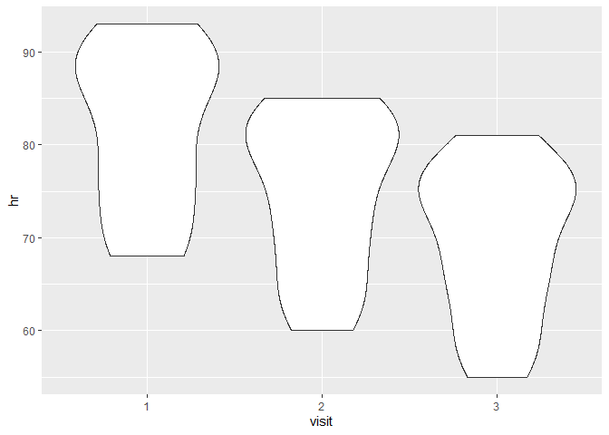
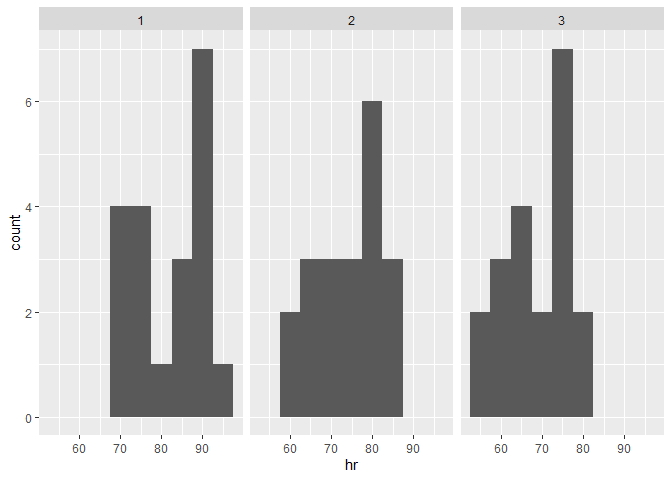
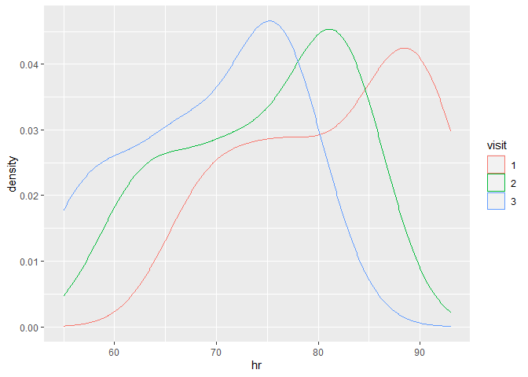
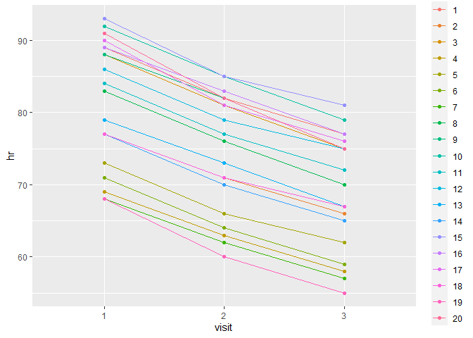
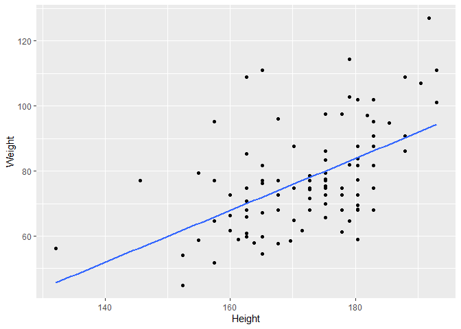

Session 4
================
Dominic Bordelon, Research Data Librarian, University of Pittsburgh
Library System
July 5, 2022

# Session 4: More practice, intro to modeling

## Agenda

1.  Review of what we’ve learned using a new file
2.  Linear regressions
3.  Resources and approaches to keep learning

## Review of what we’ve learned using a new file

We will use the
[messy_bp.xlsx](https://github.com/higgi13425/medicaldata#available-messy-datasets-beta)
file from the {medicaldata} GitHub. This file has one row per patient,
but records HR and BP for 3 different visits. We’re going to clean,
“tidy,” and visualize these data using what we’ve learned in sessions 2
and 3.

{forcats} cheat sheet, for working with factors (categorical variables):
<https://raw.githubusercontent.com/rstudio/cheatsheets/main/factors.pdf>

``` r
library(tidyverse)
library(lubridate)
library(readxl)
library(janitor)
library(tidymodels)
library(skimr)
library(medicaldata)
```

### Import data and fix patient IDs

``` r
stop <- read_excel("data/messy_bp.xlsx", 
    range = "A4:M24")
```

    New names:
    • `BP` -> `BP...8`
    • `HR` -> `HR...9`
    • `BP` -> `BP...10`
    • `HR` -> `HR...11`
    • `BP` -> `BP...12`
    • `HR` -> `HR...13`

``` r
study_date <- as.Date("2020-10-20")

# fix duplicate patient IDs:
stop <- stop %>% mutate(pat_id = row_number())
View(stop)
```

### Clean variable names, calculate age, categorical variables as factors

``` r
stop <- stop %>% 
  clean_names() 

stop <- stop %>% 
  mutate(birth_date = 
           make_date(year=year_birth,
                     month=month_of_birth,
                     day=day_birth), 
         .after=pat_id) %>% 
  mutate(age = 
           trunc((birth_date %--% study_date)/years(1)), 
         .after=birth_date) %>% 
  select(-c(year_birth,month_of_birth,day_birth,birth_date)) %>%
  mutate(pat_id = as_factor(pat_id),
         race = as_factor(race),
         sex = as_factor(sex),
         hispanic = as_factor(hispanic), 
         .after=age)
```

Another function for quickly examining dataframes is `glimpse()` from
{dplyr}, it fits every column on the screen (they are listed
vertically), with data type and preview.

``` r
glimpse(stop)
```

    Rows: 20
    Columns: 11
    $ pat_id   <fct> 1, 2, 3, 4, 5, 6, 7, 8, 9, 10, 11, 12, 13, 14, 15, 16, 17, 18…
    $ age      <dbl> 52, 29, 31, 43, 57, 47, 34, 63, 59, 52, 49, 50, 57, 31, 29, 3…
    $ race     <fct> White, Caucasian, White, Other, Black, Black, White, Asian, O…
    $ sex      <fct> Male, Female, Male, Female, Male, Female, Female, Female, Mal…
    $ hispanic <fct> Hispanic, Not Hispanic, Hispanic, Not Hispanic, Not Hispanic,…
    $ bp_8     <chr> "167/92", "158/99", "171/102", "155/88", "153/90", "161/94", …
    $ hr_9     <dbl> 89, 77, 88, 69, 73, 71, 68, 83, 88, 92, 84, 86, 79, 77, 93, 8…
    $ bp_10    <chr> "156/82", "147/90", "161/90", "143/80", "145/82", "152/86", "…
    $ hr_11    <dbl> 82, 71, 81, 63, 66, 64, 62, 76, 82, 85, 77, 79, 73, 70, 85, 8…
    $ bp_12    <chr> "144/71", "138/82", "153/82", "136/72", "133/74", "144/78", "…
    $ hr_13    <dbl> 77, 66, 75, 58, 62, 59, 57, 70, 75, 79, 72, 75, 67, 65, 81, 7…

### Rename HR and BP; pivot visits longer

Currently, we have one row per patient. We want 3 rows per patient (one
per visit, with BP and HR columns), because this would give us one
observation per row. It should look like this:

| pat_id | visit | sbp | dbp | hr  |
|--------|-------|-----|-----|-----|
| 1      | 1     | 120 | 100 | 97  |
| 1      | 2     | 116 | 99  | 95  |
| 1      | 3     | 110 | 99  | 93  |
| 2      | 1     | 130 | 104 | 99  |
| 2      | 2     | 128 | 102 | 98  |
| 2      | 3     | 126 | 100 | 94  |

``` r
stop <- stop %>% 
  rename(v1_bp = bp_8, v2_bp = bp_10, v3_bp = bp_12) %>% 
  mutate(v1_hr = as.character(hr_9), v2_hr = as.character(hr_11), v3_hr = as.character(hr_13)) %>%
  select(-c(hr_9, hr_11, hr_13)) %>% 
  pivot_longer(cols=c(ends_with(c("bp", "hr"))),
               names_to="visit_measure",
               values_to="value") %>% 
  separate(visit_measure, into=c("visit", "measure"))
```

### Pivot measures wider

`pivot_longer()` got rid of our separate visit columns, but BP and HR
have ended up on separate rows. We have 6 rows per patient, instead of
3. So now we need to `pivot_wider()`, to transform the intermediate
`measure` and `value` columns into BP and HR columns.

``` r
stop <- stop %>% 
  pivot_wider(names_from=measure, values_from=value)
```

### Clean `visit`, `bp`, and `hr` columns

`visit` should be a factor, and “v” is no longer needed. `bp` is
currently character information which we can’t easily analyze; let’s
separate it into two numeric variables, `sbp` and `dbp`. `hr` can now be
converted to a numeric as well.

``` r
stop <- stop %>% 
  mutate(visit = as_factor(substr(visit,2,3))) %>% 
  separate(bp, into=c("sbp", "dbp")) %>% 
  mutate(sbp=as.numeric(sbp), 
         dbp=as.numeric(dbp), 
         hr=as.numeric(hr))
```

### Recode `race`

We have multiple values for “White” which should be collapsed into one
category.

``` r
stop <- stop %>% 
  mutate(race = fct_collapse(race, `White` = c("White", "Caucasian", "WHITE")))

stop
```

    # A tibble: 60 × 9
       pat_id   age race  sex    hispanic     visit   sbp   dbp    hr
       <fct>  <dbl> <fct> <fct>  <fct>        <fct> <dbl> <dbl> <dbl>
     1 1         52 White Male   Hispanic     1       167    92    89
     2 1         52 White Male   Hispanic     2       156    82    82
     3 1         52 White Male   Hispanic     3       144    71    77
     4 2         29 White Female Not Hispanic 1       158    99    77
     5 2         29 White Female Not Hispanic 2       147    90    71
     6 2         29 White Female Not Hispanic 3       138    82    66
     7 3         31 White Male   Hispanic     1       171   102    88
     8 3         31 White Male   Hispanic     2       161    90    81
     9 3         31 White Male   Hispanic     3       153    82    75
    10 4         43 Other Female Not Hispanic 1       155    88    69
    # … with 50 more rows
    # ℹ Use `print(n = ...)` to see more rows

### Examine tidied data

In addition to `str()`/`glimpse()` and `summary()`, check out also
`skim()` from {skimr}.

Make sure to click through `skim()`’s multiple outputs: a Data Summary
showing row/column counts and grouping metadata; and a distinct data
frame for each data type (numeric, character…). The data frame has a row
for each variable of that type, and columns according to the data type.
So numeric variables show \# missing (`NA`), mean, SD, quartiles, and
even a mini histogram. (You’ll need to run `skim(stop)` directly in the
console, not in the notebook, to see the histograms.) Factors say
whether they are ordered, \# unique values, and most frequent values
with their counts.

``` r
str(stop)
```

    tibble [60 × 9] (S3: tbl_df/tbl/data.frame)
     $ pat_id  : Factor w/ 20 levels "1","2","3","4",..: 1 1 1 2 2 2 3 3 3 4 ...
     $ age     : num [1:60] 52 52 52 29 29 29 31 31 31 43 ...
     $ race    : Factor w/ 4 levels "White","Other",..: 1 1 1 1 1 1 1 1 1 2 ...
     $ sex     : Factor w/ 2 levels "Male","Female": 1 1 1 2 2 2 1 1 1 2 ...
     $ hispanic: Factor w/ 2 levels "Hispanic","Not Hispanic": 1 1 1 2 2 2 1 1 1 2 ...
     $ visit   : Factor w/ 3 levels "1","2","3": 1 2 3 1 2 3 1 2 3 1 ...
     $ sbp     : num [1:60] 167 156 144 158 147 138 171 161 153 155 ...
     $ dbp     : num [1:60] 92 82 71 99 90 82 102 90 82 88 ...
     $ hr      : num [1:60] 89 82 77 77 71 66 88 81 75 69 ...

``` r
glimpse(stop)
```

    Rows: 60
    Columns: 9
    $ pat_id   <fct> 1, 1, 1, 2, 2, 2, 3, 3, 3, 4, 4, 4, 5, 5, 5, 6, 6, 6, 7, 7, 7…
    $ age      <dbl> 52, 52, 52, 29, 29, 29, 31, 31, 31, 43, 43, 43, 57, 57, 57, 4…
    $ race     <fct> White, White, White, White, White, White, White, White, White…
    $ sex      <fct> Male, Male, Male, Female, Female, Female, Male, Male, Male, F…
    $ hispanic <fct> Hispanic, Hispanic, Hispanic, Not Hispanic, Not Hispanic, Not…
    $ visit    <fct> 1, 2, 3, 1, 2, 3, 1, 2, 3, 1, 2, 3, 1, 2, 3, 1, 2, 3, 1, 2, 3…
    $ sbp      <dbl> 167, 156, 144, 158, 147, 138, 171, 161, 153, 155, 143, 136, 1…
    $ dbp      <dbl> 92, 82, 71, 99, 90, 82, 102, 90, 82, 88, 80, 72, 90, 82, 74, …
    $ hr       <dbl> 89, 82, 77, 77, 71, 66, 88, 81, 75, 69, 63, 58, 73, 66, 62, 7…

``` r
summary(stop)
```

         pat_id        age           race        sex             hispanic  visit 
     1      : 3   Min.   :29.00   White:33   Male  :30   Hispanic    :24   1:20  
     2      : 3   1st Qu.:32.00   Other: 6   Female:30   Not Hispanic:36   2:20  
     3      : 3   Median :46.00   Black:15                                 3:20  
     4      : 3   Mean   :44.25   Asian: 6                                       
     5      : 3   3rd Qu.:52.25                                                  
     6      : 3   Max.   :63.00                                                  
     (Other):42                                                                  
          sbp             dbp               hr       
     Min.   :126.0   Min.   : 68.00   Min.   :55.00  
     1st Qu.:144.0   1st Qu.: 80.00   1st Qu.:68.00  
     Median :155.0   Median : 89.00   Median :76.00  
     Mean   :155.3   Mean   : 90.05   Mean   :75.22  
     3rd Qu.:166.2   3rd Qu.: 98.00   3rd Qu.:82.00  
     Max.   :192.0   Max.   :194.00   Max.   :93.00  
                                                     

``` r
skim(stop)
```

|                                                  |      |
|:-------------------------------------------------|:-----|
| Name                                             | stop |
| Number of rows                                   | 60   |
| Number of columns                                | 9    |
| \_\_\_\_\_\_\_\_\_\_\_\_\_\_\_\_\_\_\_\_\_\_\_   |      |
| Column type frequency:                           |      |
| factor                                           | 5    |
| numeric                                          | 4    |
| \_\_\_\_\_\_\_\_\_\_\_\_\_\_\_\_\_\_\_\_\_\_\_\_ |      |
| Group variables                                  | None |

Data summary

**Variable type: factor**

| skim_variable | n_missing | complete_rate | ordered | n_unique | top_counts                       |
|:--------------|----------:|--------------:|:--------|---------:|:---------------------------------|
| pat_id        |         0 |             1 | FALSE   |       20 | 1: 3, 2: 3, 3: 3, 4: 3           |
| race          |         0 |             1 | FALSE   |        4 | Whi: 33, Bla: 15, Oth: 6, Asi: 6 |
| sex           |         0 |             1 | FALSE   |        2 | Mal: 30, Fem: 30                 |
| hispanic      |         0 |             1 | FALSE   |        2 | Not: 36, His: 24                 |
| visit         |         0 |             1 | FALSE   |        3 | 1: 20, 2: 20, 3: 20              |

**Variable type: numeric**

| skim_variable | n_missing | complete_rate |   mean |    sd |  p0 | p25 | p50 |    p75 | p100 | hist  |
|:--------------|----------:|--------------:|-------:|------:|----:|----:|----:|-------:|-----:|:------|
| age           |         0 |             1 |  44.25 | 11.04 |  29 |  32 |  46 |  52.25 |   63 | ▇▁▅▅▅ |
| sbp           |         0 |             1 | 155.33 | 15.00 | 126 | 144 | 155 | 166.25 |  192 | ▅▆▇▆▁ |
| dbp           |         0 |             1 |  90.05 | 18.28 |  68 |  80 |  89 |  98.00 |  194 | ▇▃▁▁▁ |
| hr            |         0 |             1 |  75.22 |  9.58 |  55 |  68 |  76 |  82.00 |   93 | ▃▅▇▆▃ |

### Plot tidied data

Below are a few ways to plot these data, focusing on `visit`, but of
course there are many more possibilities.

The `facet_wrap()` example uses the typical `geom_histogram()`, mapped
to `hr`, then adds a layer for `visit` which “facets” or subplots the
histogram into one per each visit.

The last example, using `geom_path()`, requires that you supply the
`group` aesthetic mapping, so that it knows which nodes to connect.

Remember that if you wonder about any function you see used, you can
search it in the help system, by running, e.g., `?geom_path`

``` r
stop %>% 
  ggplot(aes(x=visit, y=hr)) +
  geom_violin()
```



``` r
stop %>% 
  ggplot(aes(hr)) +
  geom_histogram(binwidth=5) +
  facet_wrap(~ visit)
```



``` r
stop %>% 
  ggplot(aes(x=hr, color=visit)) +
  geom_density()
```



``` r
stop %>% 
  ggplot(aes(x=visit, y=hr, color=pat_id)) +
  geom_point() +
  geom_path(aes(group=pat_id))
```



## Linear regressions

R’s function to calculate a correlation coefficient is `cor()`. To use
it with your dataframes and {dplyr}, use it inside of `summarize()`. You
can also use groupings this way.

``` r
smartpill %>% 
  summarize(cor(Height, Weight))
```

      cor(Height, Weight)
    1           0.5384256

``` r
smartpill %>% 
  group_by(Gender) %>% 
  summarize(cor(Height, Weight))
```

    # A tibble: 2 × 2
      Gender `cor(Height, Weight)`
       <dbl>                 <dbl>
    1      0                 0.395
    2      1                 0.466

Because of R’s long history as a statistical software, base-R has many
builtin functions for modeling and tests. `lm()` is an example which
fits a linear model to the formula you supply.

Formulas have a left-hand side (LHS), a tilde (`~`), and a right-hand
side (RHS), i.e., `LHS ~ RHS`. A model formula is typically structured
as `response ~ explanatory`, e.g., `Weight ~ Height`. Multiple terms may
be combined within one side or the other using operators like `+` and
`*`.

When you run `lm()` or other modeling functions, they will create a
model object, which you’ll assign to an object as you would a data
frame. `summary()` gives readable info about a linear model.

``` r
hw_model <- lm(Weight ~ Height, data=smartpill)
hw_model
```


    Call:
    lm(formula = Weight ~ Height, data = smartpill)

    Coefficients:
    (Intercept)       Height  
       -59.8601       0.7985  

``` r
summary(hw_model)
```


    Call:
    lm(formula = Weight ~ Height, data = smartpill)

    Residuals:
        Min      1Q  Median      3Q     Max 
    -25.170 -10.040  -2.490   6.741  39.162 

    Coefficients:
                Estimate Std. Error t value Pr(>|t|)    
    (Intercept) -59.8601    22.3310  -2.681  0.00869 ** 
    Height        0.7985     0.1296   6.162 1.82e-08 ***
    ---
    Signif. codes:  0 '***' 0.001 '**' 0.01 '*' 0.05 '.' 0.1 ' ' 1

    Residual standard error: 13.61 on 93 degrees of freedom
    Multiple R-squared:  0.2899,    Adjusted R-squared:  0.2823 
    F-statistic: 37.97 on 1 and 93 DF,  p-value: 1.824e-08

We can also use `lm` as a method for fitting `geom_smooth()` in ggplot2:

``` r
smartpill %>% 
  ggplot(aes(x=Height, y=Weight)) +
  geom_point() +
  geom_smooth(method="lm", formula=y ~ x, se=FALSE)
```



Because R accumulated many statistical functions over time in a
decentralized way, there aren’t consistent design patterns, making the
quirks of different functions and packages annoying to learn and use.
{[tidymodels](https://www.tidymodels.org/)} is an umbrella package which
brings together many modeling functions under a common interface which
is compatible with tidyverse structures and functions.

## Resources and approaches to keep learning

-   Approaches
    -   Work through a free ebook about a topic such as modeling,
        machine learning, bioinformatics in R, or geospatial analysis
        (see Resources below)
    -   Follow [\#RStats](https://twitter.com/hashtag/rstats) on
        Twitter, explore what people are talking about
    -   [Tidy Tuesday](https://github.com/rfordatascience/tidytuesday):
        “Join the `R4DS Online Learning Community` in the weekly
        `#TidyTuesday` event! Every week we post a raw dataset, a chart
        or article related to that dataset, and ask you to explore the
        data. While the dataset will be”tamed”, it will not always be
        tidy! As such you might need to apply various
        `R for Data Science` techniques to wrangle the data into a true
        tidy format. The goal of `TidyTuesday` is to apply your R
        skills, get feedback, explore other’s work, and connect with the
        greater `#RStats` community! As such we encourage everyone of
        all skills to participate!”
    -   Join `discoRd`, the R users’ Discord server:
        <https://discord.gg/wmkCdwK>
-   Resources
    -   [Big Book of R](https://www.bigbookofr.com/), a comprehensive
        directory of books, many of which are free ebooks

    -   [R for Data Science](https://r4ds.had.co.nz/) (R4DS), a standard
        intro ebook, covering much of the content of this course more
        thoroughly

    -   [ModernDive](https://moderndive.com/), similar to R4DS, with
        more of an emphasis on statistics (modeling, tests, etc.)

    -   [The Book of
        R](https://pitt.primo.exlibrisgroup.com/permalink/01PITT_INST/i25aoe/cdi_safari_books_v2_9781492017486)
        (Davies, 2016) is a good general reference for base R; also has
        exercises

    -   [LinkedIn
        Learning](https://www.technology.pitt.edu/services/ondemand-training-linkedin-learning)
        has some R content if you prefer video
